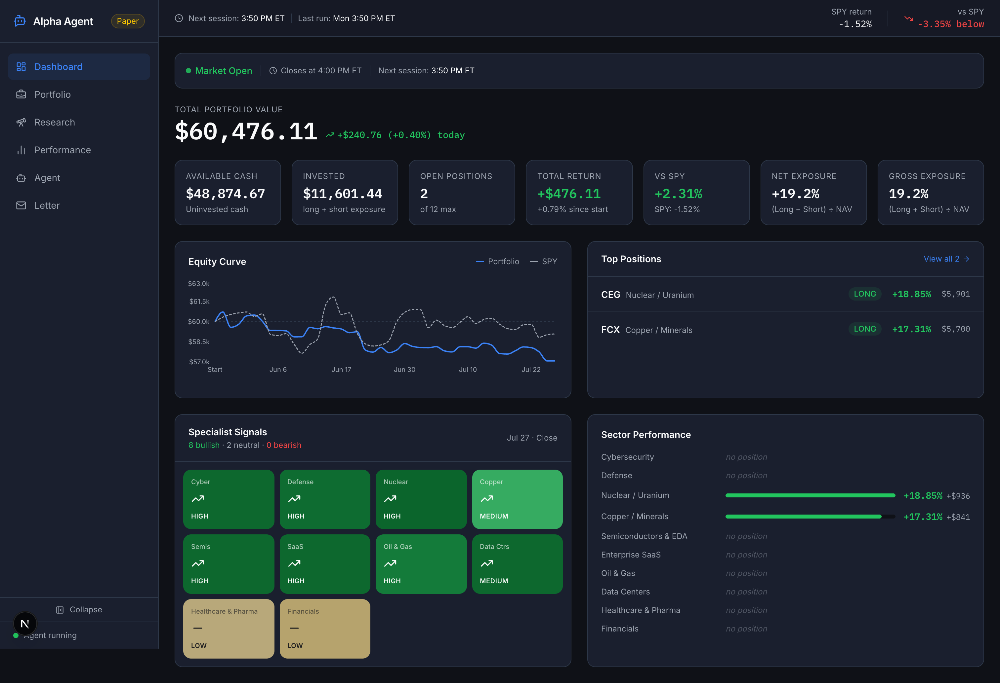

# Stocks Investment Agent

**A multi-agent paper-trading system that audits itself, files pull requests against its own codebase, and is structurally prevented from deploying its own changes.**

Eleven LLM agents research and trade a $60,000 paper portfolio across 100 US equities. A separate meta-layer reviews the fund every week, diagnoses its own failures, writes the fixes as code, and opens them as PRs — where a human, and only a human, decides whether they ship.


| | |
|---|---|
| **Live for** | 3 months of continuous autonomous operation |
| **Sessions** | 3 trading sessions/day + a 30-minute watchdog + a nightly integrity canary |
| **Agents** | 10 sector specialists → 1 portfolio orchestrator → 1 post-mortem attributor |
| **Self-audit** | Weekly, longitudinal, ships coded PRs |



<sub>Live dashboard — equity curve vs SPY, the 10-specialist signal grid, and sector attribution.
More: [portfolio](docs/screenshots/portfolio.png) · [performance](docs/screenshots/performance.png) · [agent calibration](docs/screenshots/agent.png) · [research](docs/screenshots/research.png) · [investor letter](docs/screenshots/letter.png)</sub>

---

## Why this is interesting

Most "AI trading bot" projects are a prompt and a broker API. The hard problems here weren't in the trading logic — they were in everything around it:

**1. An agent that improves its own source code, safely.** A weekly headless Claude Code run audits the fund across 7 levers, reads every prior audit for longitudinal context, and codes its proposals into PRs. The safety property is a boundary, not a promise: the audit holds a **SELECT-only database role** (the DB itself rejects writes), runs with **all MCP servers disabled** so it cannot reach a writable connection, is **GET-only** against n8n and the broker, and **can never merge or push to `main`**. Proposals are tiered by blast radius — `[A]` tunable fix, `[B-code]` isolated code-only change, `[B-spec]` anything requiring infrastructure rewiring, which stays prose until a human builds it. Worst case is a PR you close.

**2. Silent failures are the real enemy.** In a system where every stage has a fallback, a broken component doesn't crash — it returns empty and everything downstream quietly degrades. Two examples this codebase caught the hard way:
- A dropped database column made one query fail; `continueOnFail` swallowed it; a confidence cap defaulted on; **the fund sat 100% in cash for two days** without a single error.
- The price-data API applies its row limit *across* symbols, not per symbol. As the history window grew, the limit was silently outgrown and the alphabetically-last ticker in each batch began receiving **year-old prices**. Three trades were sized and recorded against fiction before a weekly audit caught it.

Both drove permanent additions to a deterministic daily canary that reconciles the database against the broker and alarms on integrity classes, not exceptions.

**3. Feedback loops that close.** Every closed position triggers an attribution post-mortem. Specialist confidence is recalibrated against realized hit rate. Entry patterns accumulate expected value and negative-EV patterns block new entries. Lessons are injected into the next session's context.

---

## Architecture

```
                    ┌─────────────── Fundamentals Refresh (8:30 AM) ───┐
                    ▼                                                   │
   RSS + Price Bars + Fundamentals                                      │
                    │                                                   │
                    ▼                                                   │
   ┌────────── 10 Sector Specialists (Gemini 2.5 Flash, parallel) ──────┘
   │  cybersecurity · defense · nuclear · copper · semis
   │  SaaS · oil&gas · data centers · healthcare · financials
   └────────────────────────────┬───────────────────────────────
                                ▼
                  Portfolio Orchestrator (GPT-5.1)
                  live positions · correlation · earnings
                  calibrated confidence · past lessons
                                │
                    ┌───────────┴───────────┐
                    ▼                       ▼
         Hard Risk Limits (code)      Watchlist / Letters
         position caps · sector caps
         extension gate · throttle
                    │
                    ▼
              Alpaca (paper) ──── GTC trailing stops
                    │
                    ▼
         Post-Mortem Attribution ──► calibration feedback
```

**Guardrails live in code, not prompts.** The orchestrator can output anything; a deterministic layer enforces max positions, per-sector caps, short exposure, a cash guard, a ±5% entry-extension gate, and a per-session entry throttle. An LLM cannot argue its way past them.

**Three independent safety layers.** A watchdog checks open positions every 30 minutes and self-heals missing stops. A nightly canary reconciles three sources of truth (broker, trade ledger, position metadata) and alarms on drift. A weekly audit looks for what the canary structurally cannot see.

---

## Tech Stack

| Layer | Choice | Why |
|---|---|---|
| Orchestration | n8n (Railway) | Visual DAG for a branching multi-agent pipeline; parallel fan-out is native |
| Database | Neon Postgres | Serverless; role separation gave the audit layer its read-only capability |
| Execution | Alpaca Paper API | Native GTC trailing stops — no price-polling loop needed |
| Specialists | Gemini 2.5 Flash | 10 parallel calls/session; thinking disabled cut cost ~85% |
| Orchestrator | GPT-5.1 | The one call doing genuine multi-constraint reasoning |
| Dashboard | Next.js 15 / Vercel | 6 pages against Neon + Alpaca |
| Meta-audit | Claude Code (headless) in GitHub Actions | Runs with the laptop off |

---

## Engineering decisions worth discussing

**Cost shape over model quality.** Specialists moved GPT-4o → Gemini 2.5 Flash with thinking disabled (~$14/mo → ~$2/mo) after measuring that thinking tokens were ~80% of spend for a structured-output task. The orchestrator stayed on the frontier model — it's one call per session and the only one doing real reasoning. Spend where reasoning compounds.

**Deterministic where correctness matters.** Share counts are recomputed from live prices, never taken from LLM output. All generated text is escaped before SQL interpolation. Risk limits are code. The LLM proposes; arithmetic disposes.

**`merge == deploy`, with a drift guard.** Merging a code-node change triggers a sync that pushes it into the live workflow — but it first verifies the live node still matches what git held *before* the merge. If someone hand-edited production, it refuses and alerts rather than clobbering.

**Honest instrumentation.** The `audits/` directory is the project's most interesting reading: unedited weekly reports where the system grades itself 🔴 and documents its own data-corruption incidents. They're published deliberately — the failure analysis is the engineering.

---

## Results, honestly

The fund **underperformed**. Over the tracked window (2026-05-28 → 2026-07-27, 200 sessions):

| | |
|---|---|
| Fund | **−4.87%** |
| SPY, same window | **−1.52%** |
| Alpha | **−3.35pp** |
| Closed trades | 40 · **35% win rate** · −$1,401 realized |

It ran autonomously for three months and is now paused.

I'm publishing the numbers because the interesting part isn't the return — it's what the
system found out about itself. The `audits/` directory contains unedited weekly reports
where it grades its own levers 🔴 and diagnoses its own failures. A representative one:

> *"The fund traded for two weeks on partially fictional prices — and the books are wrong
> even though the broker is fine."* — [audit 2026-07-19](audits/2026-07-19.md)

That audit traced a data-integrity bug through to its consequences: a price API's row limit
silently outgrown, ten tickers served year-old prices, three trades sized and recorded
against fiction, and a reported P&L that was **$1,580 wrong in the fund's own favour**. It
then wrote the detection and a fail-closed guard as two separate pull requests.

Diagnosing that is harder than picking stocks, and it's the part of this project I'd
want to be judged on.

## Repository Map

```
workflows/code/      # Node logic — the trading brain (version-controlled, auto-deployed)
prompts/             # Specialist / orchestrator / post-mortem system prompts
automation/          # Self-audit layer: canary, weekly audit, n8n sync, backtest
audits/              # Weekly self-audit reports + initiatives register
web/                 # Next.js dashboard
.github/workflows/   # Scheduled canary, weekly audit, deploy sync
```

---

## Running it

The trading system is infrastructure-dependent — it needs an n8n instance, a Neon database, and Alpaca keys, so it isn't `git clone && npm start`. What *is* directly runnable:

```bash
# Dashboard (needs DATABASE_URL + Alpaca keys in web/.env.local)
cd web && npm install && npm run dev

# Integrity canary against your own deployment
node automation/canary.mjs

# Backtest harness — replays entry gates against historical bars
node automation/backtest.mjs
```

The n8n workflow topology is documented in `workflows/*_blueprint.md`, and every Code node's source is in `workflows/code/`, mapped to its live node by `automation/n8n_manifest.json`.

---

## License

MIT — see [LICENSE](LICENSE).
